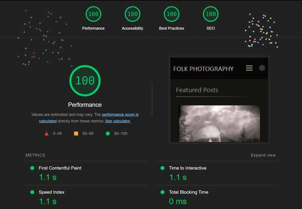

                ================== SIMPLE FOLK ==================

**Description**: SimpleFolk is a WordPress theme I am developing for [my photography site](https://www.folkphotography.com).

My goal is to get this site as fast as possible and ticking all the boxes for performance, security, seo, and accessibility. Working now on making the theme more versatile and plan to share it with an open license when it is ready.

Latest lightouse snapshot from 2022-08-09 :

Another goal of building this was to remove the dependence on numerous plugins. Plugins are great but I wanted an all in one solution to keep it simple, have control over it, and reduce as much page weight as possible.

    Features

- **Photocentric** - Unlike most themes that center around posts and pages, this theme is built mainly around the media gallery
- **SEO** - Theme adds breadcrumb support, dynamic titles, and dynamic meta description.
- **Fully Responsive** - Website flexes to give the user the best experience on any device.
- **Analytics** - Setup to work with a unique API key added to the admin
- **Darkmode/Lightmode toggle** - Built in frontend toggle to give the user their preferred style. It is a todo to add color palletes to the admin customizer.
- **Organization** - tag filters and gallery, dedicated tag and category archive pages
- **Image modals** - using glightbox for zoom views
- **Masonry** - Uses isotope for filters and flexible layouts

---

    Changelog

The format is based on [Keep a Changelog](https://keepachangelog.com/en/1.0.0/),
and this project adheres to [Semantic Versioning](https://semver.org/spec/v2.0.0.html).

## [2.0.0] - 2022-09-10

### Added

- total overhaul on structure, using includes/ to structure the loops
- featured gallery and archive pages now built strictly off attachments
- posts are posts again
- glightbox for zoom view of most images on the site
- taxonomy structure for attachments
- numerous widgets for home, footer, and sidebar
- widget for featured category
- updating styles for main layouts

### Removed

- icomoon and other deprecated scripts
- custom taxonomy to use normal cat/tags for attachments

## [1.3.0] - 2022-08-09

### Added

- customizer control to disable gutenberg css

### Fixed

- bug with featured gallery tags
- fancybox loaded only on single posts
- layout bug on About page
- padding for medium screens
- all scripts in footer

### Removed

- old icomoon css
- jQuery dependency for isotope

## [1.2.0] - 2022-07-28

### Added

- websafe font stacks
- icomoon generated SVGs
- stylesheet to control admin area
- this readme

### Removed

- google fonts (kept local files ./assets/fonts/ but removed references to them )
- icomoon font icons (kept local files ./assets/icomoon/fonts/ but removed references to them )
- most of the normalize css
- animated styles for featured gallery

### Changed

- Layout updates to main wrappers to create more padding around central element
- Styles for the tag heading on tag archive page

### Fixed

- Made breadcrumbs consistent across the site, fixed the "Projects" link missing from the crumbs on single posts
- Meta data was not showing up on the single posts
- Layout bug on the media library pages, maybe coming from the meta boxes but fixed with a css rule in the new admin css

## [1.1.0] - 2022-07-22

### Added

- Customizer input for google api key

## [1.0.0] - 2022-07-22

### Added

- SEO - Meta descriptions based off custom meta box, image caption, or default
- Function to get image gallery by tag name (used for self portraits on about page)
- Inelegant solution to control sidebar for About page
- Light and Dark color palletes as CSS variables

### Changed

- Featured gallery options move from page meta boxes to use the customizer api
- Layout of top nav, breadcrumbs, and archive and featured gallery (so basically everything)

### Fixed

- SEO - Missing title and also improved title for home page
- Sidebar glitch if media keys were missing

## [0.9.2] - 2022-06-10

### Added

- Lightmode/Darkmode switch and styles
- Google font for breadcrumbs (Koulen)
- Function to include alt, width, and height attributes on an image

### Changed

- Remove custom meta box and use core Description field from media

## [0.8.2] - 2022-06-06

### Changed

- Moved all the meta information from posts to media attachment

## [0.8.1] - 2022-06-05

### Fixed

- Tag photo container not wrapping the PHP output properly

## [0.8.0] - 2022-06-05

### Changed

- Make all the Google fonts local - add rules to help fight FOUT

### Fixed

- function to display category thumbs in sidebar
