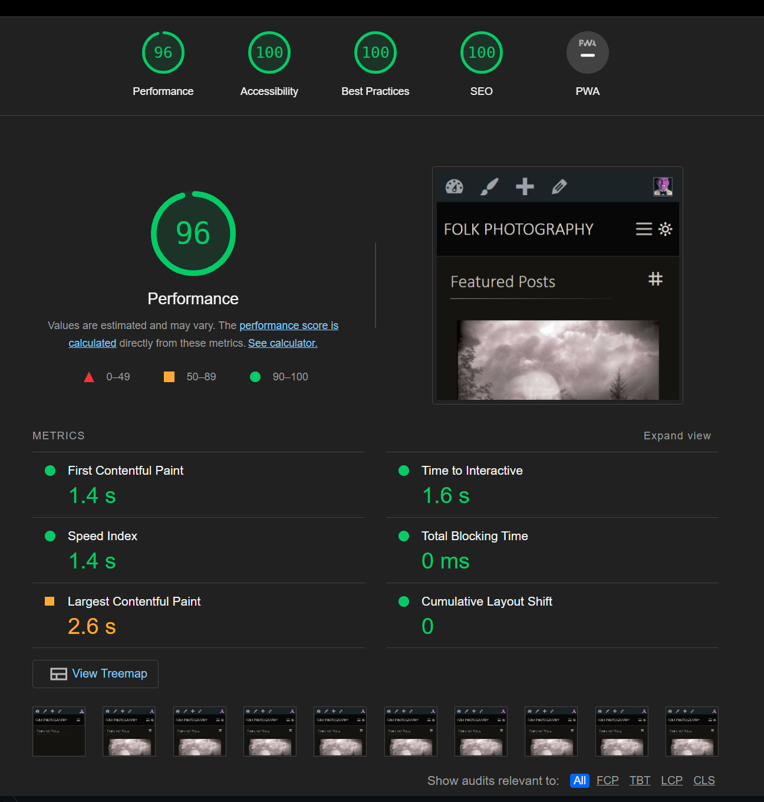

================== SIMPLE FOLK ==================

**Description**: SimpleFolk is a WordPress theme I am developing for [my photography site](folkphotography.com).

My goal is to get this site as fast as possible and a perfect score from Lighthouse; ticking all the boxes for performance, security, and accessibility.

Latest lightouse snapshot from 2022-07-27 :

When 100 is achieved and I have moved everything into configurable options. I plan to make all the updates to adhere to the WordPress guidelines and submit this as a free, open theme available from their library.

Another goal of building this was to remove the dependence on numerous plugins. Plugins are great but I wanted an all in one solution to keep it simple, have control over it, and reduce as much page weight as possible.

    Features

- **SEO** - Theme adds breadcrumb support, dynamic titles, and dynamic meta description.
- **Fully Responsive** - Website flexes to give the user the best experience on any device.
- **Analytics** - Setup to work with a unique API key
- **Darkmode/Lightmode toggle** - Built in frontend toggle to give the user their preferred style. It is a todo to add color palletes to the admin customizer.
- **Archives** - tag filters and gallery, dedicated tag and category archive pages
- **Image modals** - built in lightbox (currently fancybox)
- **Masonry** - Uses isotope for filters and flexible layouts
- **Photocentric** - This theme is all about the images uploaded to the media library. Additional meta boxes are available to add information about the image such as location, captions, film type, etc.. Future updates will refine this, adding more meta boxes and maybe use the archive pages instead of posts.

---

I am tracking this mainly as an exercise and to keep myself organized with this project.

Eventually, I plan to release this as a free community theme and will be happy to have collaborators at that time.

    Changelog

The format is based on [Keep a Changelog](https://keepachangelog.com/en/1.0.0/),
and this project adheres to [Semantic Versioning](https://semver.org/spec/v2.0.0.html).

## [Unreleased]

## [1.2.0] - 2022-07-28

### Added

- websafe font stacks
- icomoon generated SVGs
- stylesheet to control admin area
- this readme

### Removed

- google fonts (kept local files ./assets/fonts/ but removed references to them )
- icomoon font icons (kept local files ./assets/icomoon/fonts/ but removed references to them )
- most of the normalize css
- animated styles for featured gallery

### Changed

- Layout updates to main wrappers to create more padding around central element
- Styles for the tag heading on tag archive page

### Fixed

- Made breadcrumbs consistent across the site, fixed the "Projects" link missing from the crumbs on single posts
- Meta data was not showing up on the single posts
- Layout bug on the media library pages, maybe coming from the meta boxes but fixed with a css rule in the new admin css

## [1.1.0] - 2022-07-22

### Added

- Customizer input for google api key

## [1.0.0] - 2022-07-22

### Added

- SEO - Meta descriptions based off custom meta box, image caption, or default
- Function to get image gallery by tag name (used for self portraits on about page)
- Inelegant solution to control sidebar for About page
- Light and Dark color palletes as CSS variables

### Changed

- Featured gallery options move from page meta boxes to use the customizer api
- Layout of top nav, breadcrumbs, and archive and featured gallery (so basically everything)

### Fixed

- SEO - Missing title and also improved title for home page
- Sidebar glitch if media keys were missing

## [0.9.2] - 2022-06-10

### Added

- Lightmode/Darkmode switch and styles
- Google font for breadcrumbs (Koulen)
- Function to include alt, width, and height attributes on an image

### Changed

- Remove custom meta box and use core Description field from media

## [0.8.2] - 2022-06-06

### Changed

- Moved all the meta information from posts to media attachment

## [0.8.1] - 2022-06-05

### Fixed

- Tag photo container not wrapping the PHP output properly

## [0.8.0] - 2022-06-05

### Changed

- Make all the Google fonts local - add rules to help fight FOUT

### Fixed

- function to display category thumbs in sidebar
